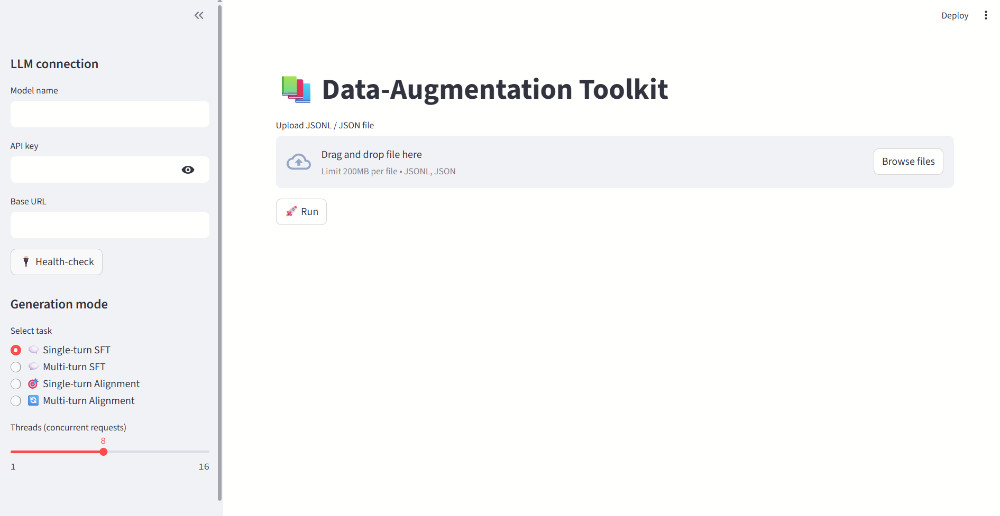

# 📚 Data-Augmentation Toolkit

A Streamlit-based UI that lets you:

* **Upload** single- or multi-turn SFT / Alignment datasets (`.jsonl` or `.csv`)
* **Validate** the file _before_ launching the heavy pipeline
* **Run** the data-augmentation pipeline with live logs & progress bar
* **Download** the generated **JSONL** in one click
* **Check** your LLM endpoint instantly via a **Health-Check** button



---

## ✨ Features

| Area | What it does |
|------|--------------|
| **LLM Connection** | Enter `model_name`, `api_key`, `base_url` & press **Health-Check** to verify connectivity. |
| **Generation Mode** | Choose between single/multi-turn **SFT** or **Alignment** pipelines. |
| **Threading** | Adjustable worker slider (1-16) controls concurrent requests. |
| **File Validation** | Early checks for broken JSONL, malformed CSV, or wrong extensions with descriptive errors. |
| **Live Feedback** | Real-time `tqdm` progress + log stream in the main pane. |
| **Output** | Final JSONL is offered for download; CSV deliberately omitted to keep training format consistent. |

---

## 🛠  Quick Start

```bash
# 1. Clone & enter the repo
git clone https://github.com/your-org/data-augmentation-toolkit.git
cd data-augmentation-toolkit

# 2. Create env & install deps
python -m venv .venv
source .venv/bin/activate      # Windows: .venv\Scripts\activate
pip install -r requirements.txt

# 3. Run the Streamlit app
streamlit run app.py
